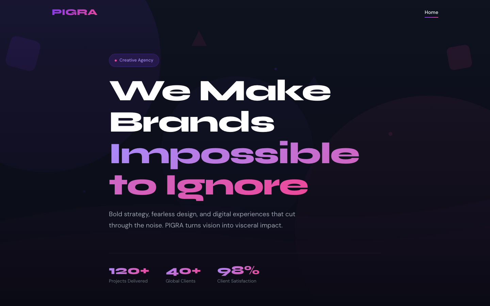

# PIGRA — Creative Agency HTML Template

A premium, framework-free HTML template for creative and digital agencies. PIGRA pairs a bold purple-to-pink gradient with a deep charcoal ground, striking oversized typography, and a portfolio-first layout built to make creative work stand out.

## 📸 Screenshot

## 🎨 Design System

| Token | Value | Usage |
|-------|-------|-------|
| `--purple` | `#7C3AED` | Primary accent, CTAs, gradients |
| `--pink` | `#EC4899` | Secondary accent, gradient partner |
| `--dark` | `#111827` | Backgrounds, cards, footer |
| `--bg` | `#0a0a14` | Page background |
| `--gray` | `#6B7280` | Body text |
| `--gradient` | purple → pink `135deg` | Headings, CTA, highlights |
| Headings | Syne (600/700/800) | Bold display type |
| Body | DM Sans (300–700) | Clean geometric sans |

## 📄 Pages

| Page | Description | Sections |
|------|-------------|----------|
| [index.html](index.html) | Home | Hero, services (6: brand strategy, visual identity, digital design, campaigns, motion & video, digital marketing), portfolio (6), testimonials, contact |

## ⚙️ Tech Stack

- **HTML5** — semantic markup, accessibility-first
- **CSS3** — custom properties, Grid, Flexbox, `clamp()`, gradient text
- **Vanilla JS** — IntersectionObserver reveals, portfolio filtering, active-nav highlight, contact-form validation
- **Fonts** — Google Fonts (Syne + DM Sans)
- No frameworks, no build step, no dependencies

## 📁 Images

All imagery lives in `assets/img/` — 26 files including portfolio shots, blog imagery, team portraits, testimonials, and layered SVG backgrounds.

---

**Template by uiuxlabz** — framework-free, responsive, production-ready.

### Let's Build Something Together 🚀

[https://tally.so/r/q4q1L9](https://tally.so/r/q4q1L9)
